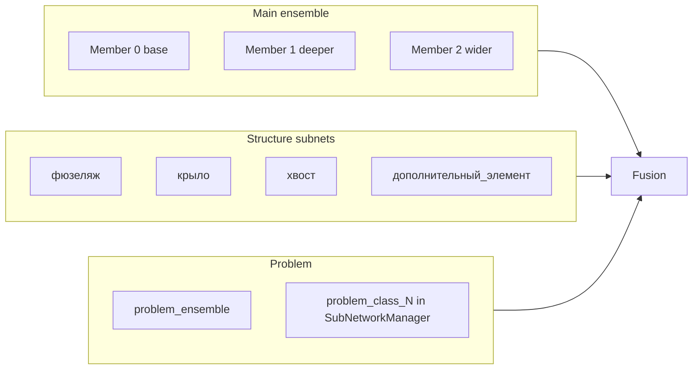

# Подсети, SVM и выделение структуры — разбор по коду

## 1. Сколько подсетей и какая архитектура

В системе три уровня сетей.

### 1.1. Основной ансамбль (ensemble) — 3 сети

Фиксированное число: **3 нейросети** в [UniversalImageClassifier.cpp](c:/Users/minis/Documents/Eigen/UniversalImageClassifier.cpp) (строки 66–86).

- **Член 0:** базовая архитектура из `NeuralNetwork::determineOptimalArchitecture(input_size, num_classes, 1000)`.
- **Член 1:** та же архитектура + один слой размером `max(num_classes*2, 32)`.
- **Член 2:** та же базовая архитектура, но первый скрытый слой расширен в 1.5 раза.

Размер входа: `image_size * image_size * 3` (по умолчанию 32×32×3). Learning rate для членов ансамбля разный: `lr * (1.0 - i * 0.2)`.

### 1.2. Подсети по типу структуры (SubNetworkManager) — динамически

Количество **не фиксировано**: подсеть создаётся под каждый **тип структуры**, который реально встретился при обучении.

Типы задаются в [ShapeAnalyzer.cpp](c:/Users/minis/Documents/Eigen/ShapeAnalyzer.cpp) в `classifyStructureType` (строки 643–661) по положению центра структуры относительно центра объекта и углу:

- **"фюзеляж"** — близко к центру (distance &lt; 0.3);
- **"крыло"** — по горизонтали (угол ≈ ±45°);
- **"хвост"** — сзади (угол ≈ ±135°);
- **"дополнительный_элемент"** — остальное.

Итого **до 4 типов** → максимум 4 подсети по структуре. Фактическое число = число уникальных типов в данных (см. цикл по `structure_features_by_type` в [UniversalImageClassifier.cpp](c:/Users/minis/Documents/Eigen/UniversalImageClassifier.cpp) 886–909). Топология подсети может достраиваться по энтропии (`morphTopology` в [SubNetworkManager.cpp](c:/Users/minis/Documents/Eigen/SubNetworkManager.cpp)).

### 1.3. Ансамбль для проблемных классов (problem_ensemble)

Отдельный ансамбль для классов с низким F1/recall/precision ([UniversalImageClassifier.h](c:/Users/minis/Documents/Eigen/UniversalImageClassifier.h) — `problem_ensemble`). Используется при классификации с анализом структуры ([UniversalImageClassifier.cpp](c:/Users/minis/Documents/Eigen/UniversalImageClassifier.cpp) 2966–2980). Размер зависит от сохранённой модели (save/load `problem_ensemble`).

---

## 2. Выделение структуры и SVM — только для проблемных картинок?

**Нет.** Анализ структуры и SVM применяются ко **всем** изображениям, когда включён `use_structure_analysis`, а не только к «проблемным».

- В [UniversalImageClassifier.cpp](c:/Users/minis/Documents/Eigen/UniversalImageClassifier.cpp) `classifyWithStructureAnalysis` (2838–3025): для **каждого** входного изображения вызывается `analyzeShape(img)`. Если структуры не найдены (`shape_desc.structures.empty()`), делается fallback на обычный `classify(img)`.
- **Проблемные классы** получают дополнительную поддержку: при наличии структур к предсказанию подсети по типу структуры добавляется взвешенный вклад `predictProblemClassSubNetwork` (2946–2952) и вывод `problem_ensemble` (2966–2980). То есть структура считается для всех, а «усиление» по проблемным классам — поверх этого.

При **обучении** структура и SVM считаются только если `use_structure_analysis == true` (в т.ч. при сборе признаков для SVM по всем изображениям, строки 799–879). В быстром режиме обучения ([ImageClassifierWithTraining.cpp](c:/Users/minis/Documents/Eigen/ImageClassifierWithTraining.cpp) 1437) анализ структуры отключают, чтобы ускорить процесс.

---

## 3. Ручные шаблоны с секторами разного цвета для SVM/сегментации?

**В этом проекте ручные шаблоны не используются.** Сегментация и выделение структур делаются **алгоритмически** по самому изображению.

Цепочка в [ShapeAnalyzer.cpp](c:/Users/minis/Documents/Eigen/ShapeAnalyzer.cpp):

1. **Сегментация** (25–40):
  - для изображений &lt; 1M пикселей — **Mean Shift** (`segmentByMeanShift`);  
  - для больших — **k-means по цвету** (`segmentByColor`).  
   Результат — сегментированное изображение (одно на кадр), не ручные «раскрашенные сектора».
2. **Форма и маска** (37): `preprocessShape(segmented)` → бинаризация (Otsu), морфология, `findContours` по маске, описание формы (центроид, aspect ratio и т.д.).
3. **Структуры (выпячивания)** (40, 329–429): `extractStructures(img, shape_mask)` — градиенты Sobel по маске, порог по magnitude, `findContours`, фильтр по площади и prominence. Каждая структура — контур + `region_image` (ROI).
4. **Тип структуры** (643–661): по геометрии (расстояние до центра, угол) назначается один из четырёх типов (фюзеляж, крыло, хвост, дополнительный_элемент).

**SVM** в [UniversalImageClassifier.cpp](c:/Users/minis/Documents/Eigen/UniversalImageClassifier.cpp) (797–879, 112–127):  
обучается на **признаках структур**, извлечённых из **тех же обучающих изображений** (пути и метки из датасета). Для каждого изображения: загрузка → `analyzeShape` → `extractStructureFeatures` → эти векторы + метка класса подаются в `trainSVM`. Отдельных «картинок-шаблонов с секторами» для сегментации или для SVM нет.

То, о чём вы читали (ручная подготовка шаблонов с секторами в разных цветах) — это другой, часто описываемый вариант использования SVM в задачах сегментации/распознавания. В **данной** реализации сегментация идёт автоматически (Mean Shift / k-means + контуры + градиенты), а SVM обучается на признаках этих автоматически полученных структур.

---

## Кратко

| Вопрос                                             | Ответ                                                                                                                                                                                           |
| -------------------------------------------------- | ----------------------------------------------------------------------------------------------------------------------------------------------------------------------------------------------- |
| Сколько подсетей?                                  | Основной ансамбль: **3**. Подсети по структуре: **до 4** (по числу типов: фюзеляж, крыло, хвост, дополнительный_элемент). Плюс при необходимости problem_ensemble и подсети проблемных классов. |
| Архитектура подсетей по структуре?                 | Динамическая: создаётся под каждый тип структуры; входной размер = размер признаков структуры; топология может достраиваться по энтропии (SubNetworkManager).                                   |
| Структура только для проблемных картинок?          | **Нет** — структура считается для **всех** изображений при включённом анализе; для проблемных классов дополнительно используются problem_ensemble и predictProblemClassSubNetwork.              |
| Нужны ли ручные шаблоны с раскрашенными секторами? | **Нет.** Сегментация — Mean Shift / k-means + контуры; структуры — по градиентам и контурам. SVM обучается на признаках этих структур из того же датасета, без отдельных шаблонов.              |

